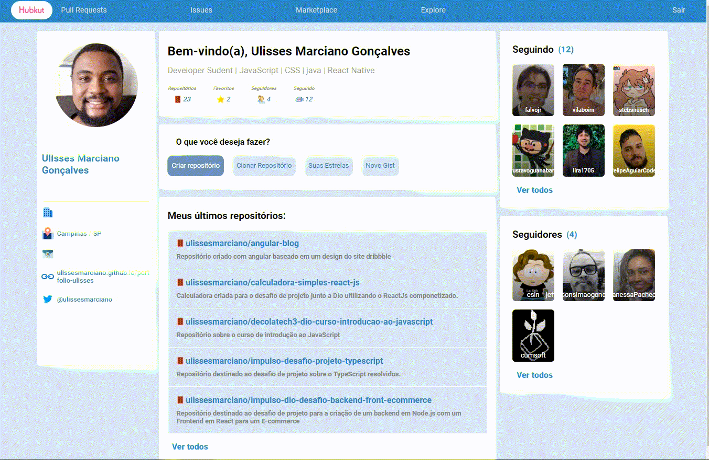

# Hubkut

Aplicação desenvolvida com Reactjs com o objetivo de treinar habilidades em Typescript e requisições via Axios da api do Github simulando a plataforma do Orkut, que é uma rede de relacionamentos que fez sucesso em meados dos anos 2000. Páginas de requisição de usuário no login, Homepage, Página de repositórios, entre outros foram criadas para a manipulação do ciclo de vida de cada componente. 

### Login:

### Navegação entre Páginas:

### Perfil de usuário

## Bibliotecas

- Reactjs
- TypeScript
- Styled Components (Estilização das páginas)
- React Router Dom (Navegação)
- Axios (para consumo da api)
- React Icons (Icones da aplicação)

Obs. Axios utilizado somente com Get para a requisição da api.